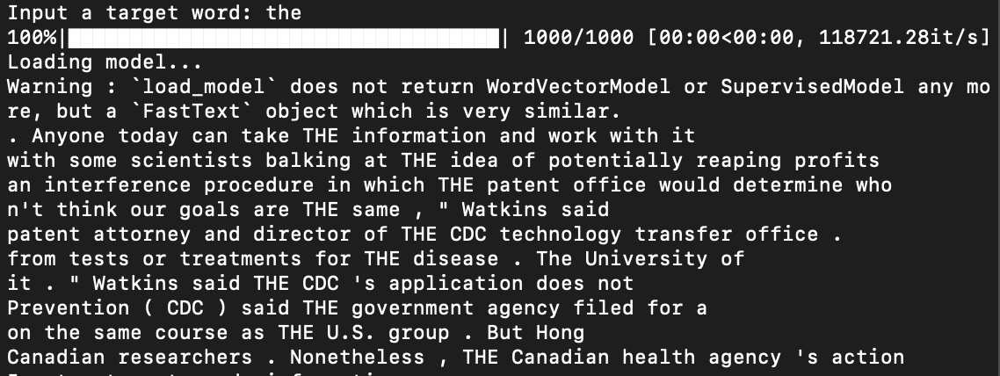
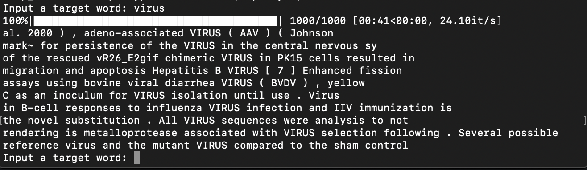
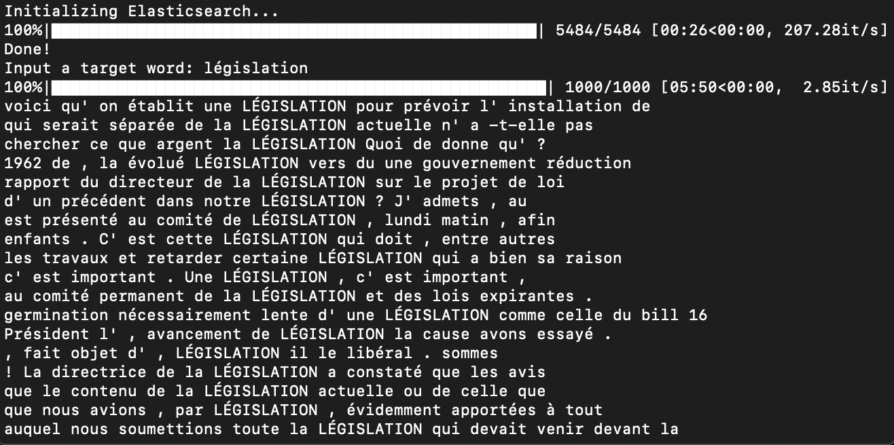

## Context Diverse Concordancer

This package is an implementation of a new concept for the traditional concordancer frameworks in use today. We make use of word vectorization techniques, transfer learning and unsupervised clustering to return context diverse concordances for our search words. This package has been developed using elasticsearch functionality to optimize search and retrieval for big corpoara. Specifically used for COVID19 and Assnat corpora for development but the tool can be used for any large text based corpora having similar annotation structure.

## Description

### About the Concordancer

To use the package, the following modules were created:

- source
    - `initialize_index.py` : script to create elasticsearch index by reading corpus zip file
    - `corpus_reader` : to retrieve instances/sentences from the corpora using elasticsearch
    - `feature_extractor` : to vectorize retrieved instances using Sbert, word2vec and fasttext
    - `cluster.py`: to perform dimensionality reduction (PCA, t-SNE) and clustering (Kmeans, OPTICS, DBSCAN)
    - `evaluator.py`: to calculate the ROUGE-LCS score distribution and cosine distance distribution 
    - `configuration.json`: A configuration file where users could set customized parameters
- data
    - `covid_slim.zip`: a subset of covid corpus(in English) which only contains 20 documents
    - `embedding_models`: to keep pretrained embeddings for using glove, word2vec methods
    - `test`: several test words
- results
    - to save clustering figures and scores

### Setting parameters

| Parameters | Options|
|------------|--------|
| CLUSTER_METHOD | *str*: kmeans, optics, dbscan|
| LANG_ID |*str*: en, fr|
|FEATURE_TYPE|*str*: sbert, fasttext, word2vec, glove|
|REDUCTION_TYPE|*str*: pca, tsne|
|N_COMPONENTS| *integer*|
|NUM_OF_SAMPLES| *integer*|
|WINDOW_SIZE|*integer*|
|MODE|*str*: user, debug|


You can set your parameters in `source/configuration.json`
```
{   
    "DATA_PATH": "../data",             # directory of your data
    "FOLDER_NAME": "covid_slim.zip",    # name of data(zipfile)
    "CLUSTER_METHOD": "kmeans",         # name of clustering method
    "LANG_ID": "en",                    # language of this corpus
    "FEATURE_TYPE": "fasttext",         # name of feature
    "REDUCTION_TYPE": "pca",            # type of reductionality dimension method
    "N_COMPONENTS": 8,                  # dimension after reduction
    "MODEL_PATH": "../data/embedding_models/glove6B_model.pkl",     # save the model under data/embedding_models/
    "NUM_OF_SAMPLES": 1000,             # number of samples retrieved from whole corpus
    "WINDOW_SIZE": 5,                   # size of window
    "TEST_FOLDER": "../data/test",      # directory of test words
    "TEST_FILE": "covid_less.json",     # filename of test words
    "MODE": "user"                      # 'user' mode will accept a user input word; 'debug' mode will take default query words
}
```

## Usage

1. Set up Elasticsearch

Considering the huge volume of datasets and following expensive searching cost, we use **Elasticsearch** to retrieve documents that contain a target word. So before you run our code, make sure you are running Elasticsearch on the background. You can download it here.
[download](https://www.elastic.co/downloads/elasticsearch)

After you have downloaded, navigate to its directory. And run this command line in the terminal.

`cd YOUR_PATH/elasticsearch-7.6.2`

`bin/elasticsearch`

*note: it will take a while to launch Elasticsearch.*

In order to check if or not you have launched it successfully, you could open `http://localhost:9200`. 

you may get:

```
{
  "name" : "XXXXX.local",
  "cluster_name" : "elasticsearch",
  "cluster_uuid" : "zxlskEQ9TCiLMa0iOEAfqA",
  "version" : {
    "number" : "7.6.2",
    "build_flavor" : "default",
    "build_type" : "tar",
    "build_hash" : "ef48eb35cf30adf4db14086e8aabd07ef6fb113f",
    "build_date" : "2020-03-26T06:34:37.794943Z",
    "build_snapshot" : false,
    "lucene_version" : "8.4.0",
    "minimum_wire_compatibility_version" : "6.8.0",
    "minimum_index_compatibility_version" : "6.0.0-beta1"
  },
  "tagline" : "You Know, for Search"
}
```

2. Prepare Data

To use the package, it is necessary to have the zip files for the COVID19 and Assnat corpora. The Assnat dataset is private so we can't release it. But we have provided a small dataset, covid_slim which you could play around. If you want a full version of COVID corpus, please contact with me. 

If you want to know more about corpora we used in this project, please look at [readme](https://github.ubc.ca/kappa224/Concordancer/tree/master/Concordancer/data) under `data`.

3. Download Pretrained Models(option)

- *[SBERT](https://github.com/UKPLab/sentence-transformers)*

  - you don't need to download SBERT model, but if you want to know more about this model, you could click [here](https://github.com/UKPLab/sentence-transformers/blob/master/docs/pretrained-models/multilingual-models.md)

  - *note: it requires ~10mins to download SBERT model for the first time.*

- *fastText*

  - we used [sister](https://github.com/tofunlp/sister) package, a fastText model wrapper, to manage our fastText models. Again you don't need to download this model manually.

  - *note: it takes around 20mins to download fastText models for the first time you run the code, but after that, it will be fast*

- *Glove and word2vec*

  - We make use of pre-trained embeddings for feature engineering, since the size of the corpora are too large to train embeddings on the extracted data. Pre-trained models will be required if you select `glove` or `word2vec` features.

  - You can download pretrained model [here](https://drive.google.com/file/d/19q9GHxh45zSjwo_BnSIUUySt-VjEvXxo/view).

  - Please unzip the model and save it under `Concordancer/data/embedding_models`

4. Install requirements

`pip3 install -r requirements.txt`

5. Run

`cd Concordancer/source`

`python3 ./main.py`

*note: for the first time you build Elasticsearch indices, it will require several minutes. Given experiment experices, there are 4-5mins for assnat corpus(5,000+ documenst) and ~30mins for covid corpus(57,000+ documents)*

Below are some demos.

<center>searching 'the' from covid_slim corpus</center>




*note: because of small number of documents, you might not get sufficient samples. In this case, please change the query word*

<center>searching 'virus' from covid corpus</center>



<center>searching 'législation' from assnat corpus</center>


